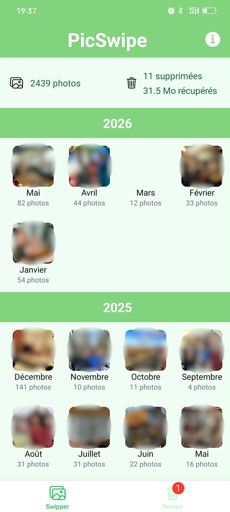
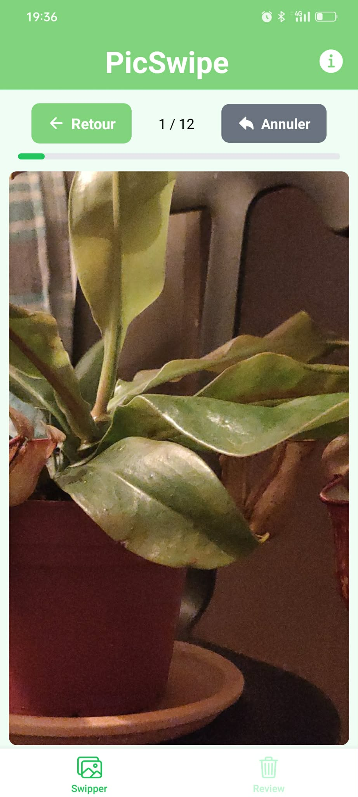
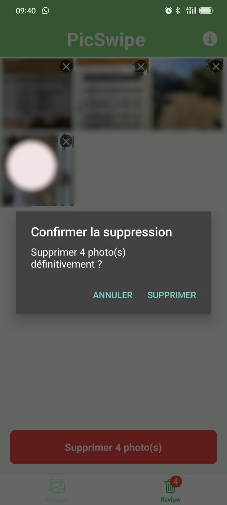

# PicSwipe

A mobile app to clean up your photo gallery — fast. Swipe right to keep, swipe left to delete. Review your choices before anything is permanently removed.

> Built with React Native + Expo. Android-first.

---

## Screenshots

| Welcome | Menu | Swipe | Review |
|---|---|---|---|
|  |  |  |  |

---

## Features

- Browse your photo library organized by month
- Swipe right to keep, swipe left to delete
- Smooth animations powered by Reanimated 4
- Review screen to confirm deletions before they happen
- Tracks cumulative deleted photos and space saved
- Decisions are saved across app restarts (persisted with AsyncStorage)

---

## Tech Stack

| Tool | Role |
|---|---|
| [Expo](https://expo.dev) | App framework and build tooling |
| [React Native](https://reactnative.dev) | UI components |
| [Expo Router](https://expo.github.io/router) | File-based navigation |
| [Reanimated 4](https://docs.swmansion.com/react-native-reanimated/) | Smooth native-thread animations |
| [Gesture Handler](https://docs.swmansion.com/react-native-gesture-handler/) | Swipe gesture detection |
| [Zustand](https://zustand-demo.pmnd.rs) | Global state management |
| [Expo MediaLibrary](https://docs.expo.dev/versions/latest/sdk/media-library/) | Access and delete photos |
| TypeScript | Type safety |

---

## Prerequisites

- [Node.js](https://nodejs.org) (v18+)
- [Expo CLI](https://docs.expo.dev/get-started/installation/) — `npm install -g expo-cli`
- [Expo Go](https://expo.dev/go) app installed on your Android device
- Or an Android emulator (Android Studio)

---

## Installation

```bash
# Clone the repository
git clone https://github.com/your-username/picswipe.git
cd picswipe

# Install dependencies
# --legacy-peer-deps is required because react@19 has peer dep conflicts
npm install --legacy-peer-deps
```

---

## Running the App

```bash
# Start the dev server and scan the QR code with Expo Go
npm start

# Or start directly on a connected Android device / emulator
npm run android
```

---

## Project Structure

```
app/
  _layout.tsx          # Root layout — wraps app in GestureHandlerRootView
  (tabs)/
    _layout.tsx        # Tab bar (Swiper / Review)
    index.tsx          # Main screen: folder grid + swipe view + stats
    review.tsx         # Review screen: confirm and delete photos

src/
  services/
    photos.service.ts  # MediaLibrary access, grouping photos by month
  hooks/
    usePhotoLibrary.ts # Loads photos progressively from device library
    useSwipeGesture.ts # Pan gesture logic + fly-off animations
  components/ui/
    SwipeCard.tsx      # Animated card showing KEEP / DELETE labels
  store/
    useDecisionStore.ts # Zustand store — keeps track of decisions and stats
```

---

## How It Works

1. On launch, the app requests access to your media library and loads photos grouped by month.
2. You enter a folder and start swiping — right to keep, left to delete.
3. Swiped photos go into a "to delete" list stored in the Zustand store, persisted with AsyncStorage.
4. On the Review tab, you see all photos marked for deletion and can confirm or cancel before anything is permanently deleted.

---

## Author

**Mathieu Chales**
- GitHub: [@your-username](https://github.com/your-username)
- LinkedIn: [your-profile](https://linkedin.com/in/your-profile)

---

## License

This project is for personal use and portfolio purposes.
